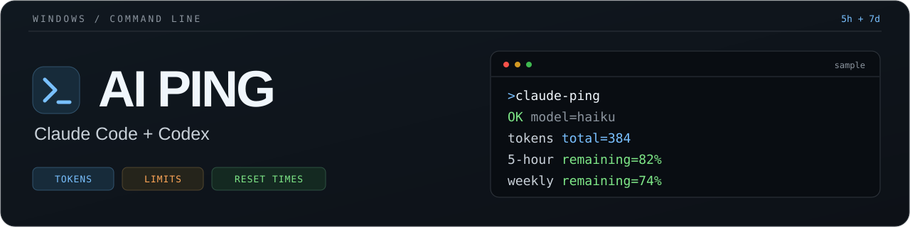

<p align="center">
  <a href="#windows-requirements"></a>
  <a href="#linux"></a>
  <a href="#windows-requirements"></a>
  <a href="LICENSE"></a>
</p>

<p align="center"><strong>English</strong> · <a href="README.ru.md">Русский</a></p>

# AI Ping

**Minimal requests to Claude Code and Codex on Windows and Linux — with the current account, token usage, and quota reset times.**

AI Ping checks subscription access with short model requests and shows the current account email, request token counts, remaining 5-hour and weekly quotas, and server reset countdowns. Run it manually, through Windows Task Scheduler, or through Linux cron to start an inactive usage window ahead of work.

[Quick start](#quick-start) · [Linux](#linux) · [Usage](#usage) · [Example output](#example-output) · [Scheduling](#scheduling) · [License](#license)

## Quick start

Choose the command for your terminal.

**Linux / WSL:**

```bash
curl -fsSL https://raw.githubusercontent.com/dprytkov/ai-ping/main/install.sh | bash
```

Works across Linux distributions with the required dependencies; see [Linux](#linux) for dependencies and scheduling.

**Windows PowerShell (5.1 / 7):**

```powershell
irm https://raw.githubusercontent.com/dprytkov/ai-ping/main/install.ps1 | iex
```

**Windows CMD:**

```bat
curl -fsSL https://raw.githubusercontent.com/dprytkov/ai-ping/main/install.bat -o install.bat && install.bat && del install.bat
```

On Windows, the installer saves a GitHub ZIP archive to disk, extracts it, and installs `ai-ping`, `claude-ping`, and `codex-ping` into `%USERPROFILE%\.local\bin`. It adds that folder to your user `PATH` without duplicates and removes the temporary archive folder. PowerShell also removes its temporary launcher; CMD deletes `install.bat` after a successful installation.

The MIT notice is installed beside the commands as `ai-ping-LICENSE.txt`.

**No Git or administrator access required.** Repeat the command to update. Open a new terminal when installation finishes:

```bat
ai-ping
```

<details>
<summary>Install from a clone or ZIP</summary>

```powershell
git clone https://github.com/dprytkov/ai-ping.git
cd ai-ping
.\ai-ping-setup.bat
```

Or [download the ZIP](https://github.com/dprytkov/ai-ping/archive/refs/heads/main.zip), extract it, and run `ai-ping-setup.bat`. Keep it beside all three ping scripts and `LICENSE`.

To inspect the internet installers first, review [install.ps1](install.ps1), [install.bat](install.bat), or [install.sh](install.sh).

</details>

## Linux

Use any Linux distribution, including WSL, with Bash, Python 3.8+, a cron daemon with user `crontab`, `flock` (util-linux), coreutils, awk, grep, curl, tar, gzip and tzdata. Install missing dependencies with your distribution's package manager and enable its cron daemon (`cron` or `crond`, depending on the distribution). In WSL, scheduled runs require the distribution and its cron daemon to be running.

The provider CLIs are optional: if `claude` or `codex` is missing, setup asks you to paste authorization copied from Windows. If a CLI is installed, sign in as the user who will run the scheduled pings. The scripts use Python's standard library, with no pip packages or jq.

From a clone or extracted archive, run setup **without sudo**:

```bash
bash ai-ping-setup.sh --start 06:00 --provider both
```

Without options, setup asks for the first daily time and `both`, `claude`, or `codex` (defaults: `06:00`, `both`). The default daily schedule is **06:00, 11:01, 16:02, 21:03 in Windows Moscow time** (`Europe/Moscow`, UTC+3), even if the Linux server uses UTC or another time zone. Runs are spaced 5 hours and 1 minute apart. For example, `--start 07:30` gives **07:30, 12:31, 17:32, 22:33**. Use `--timezone` with an IANA name matching your Windows time zone, for example `--timezone Europe/Berlin`, if it differs. Check your Windows zone in PowerShell with `Get-TimeZone`. Noninteractive runs use the schedule defaults, but require existing authorization if a selected CLI is missing. `--start` and `--provider` do not skip a required authorization prompt. Runs never start after 23:00 in the selected zone; an existing request may finish later. A missed run while the machine is off is skipped.

The internet launcher downloads and extracts the repository before calling the same setup:

```bash
curl -fsSL https://raw.githubusercontent.com/dprytkov/ai-ping/main/install.sh | bash
```

Setup installs `ai-ping`, `claude-ping`, `codex-ping`, the shared `ai-ping.py`, and `ai-ping-run` into `~/.local/bin`, plus `ai-ping-LICENSE.txt`. It adds a guarded PATH block to `.profile` and `.bashrc`; open a new Bash terminal afterward. Repeat setup to change the schedule or update scripts. It replaces only its marked block in your crontab, preserves other jobs, and sends no model requests during installation.

```bash
claude-ping sonnet
codex-ping gpt-5.6-sol
crontab -l
tail -n 40 ~/.local/state/ai-ping/ai-ping.log
```

Scheduled models can be set with `--claude-model sonnet --codex-model gpt-5.6-sol`. The runner records your installation-time PATH, `CLAUDE_CONFIG_DIR`, and `CODEX_HOME` if set, uses the same user's credentials, and prevents overlapping scheduled runs. Cron checks the selected zone once a minute; model requests run only at the scheduled times listed in its marked comment. The server's time zone and other cron jobs stay unchanged. Both providers are attempted even if one fails. It runs while signed out as long as cron and the machine are running. Logs may contain your account email. Use `crontab -e` and remove the `# BEGIN AI-PING` / `# END AI-PING` block to stop scheduling. [Detailed Linux instructions](ai-ping.md#linux).

### Copy authorization from Windows

For each selected CLI that is missing on Linux, setup shows the Windows copy command and asks for the resulting text. Open **Start → PowerShell** on the Windows computer where you already use that account; administrator rights are not needed.

**Claude (recommended for cron without a Linux CLI):** run `claude setup-token` in PowerShell and approve access in the browser. Copy the printed token and paste it into the Linux setup prompt. This token lasts one year and permits model requests; AI Ping skips quota lookup and reports that account limits are unavailable. [Long-lived Claude tokens](https://code.claude.com/docs/en/authentication#generate-a-long-lived-token).

To include account limits, you can instead import the short-lived login JSON: run `claude`, enter `/login`, sign in and exit Claude Code. Then paste this command into PowerShell and press Enter:

```powershell
$aiPingAuthDir = if ($env:CLAUDE_CONFIG_DIR) { $env:CLAUDE_CONFIG_DIR } else { Join-Path $env:USERPROFILE '.claude' }; Get-Content -Raw -LiteralPath (Join-Path $aiPingAuthDir '.credentials.json') | ConvertFrom-Json | ConvertTo-Json -Depth 20 -Compress | Set-Clipboard
```

This copies `%USERPROFILE%\.claude\.credentials.json` as one line. Its access token expires independently of the copied file and is not refreshed without Claude CLI on Linux. For unattended runs with account limits, install Claude CLI on Linux and sign in there so it can refresh the login. [Claude credential storage](https://code.claude.com/docs/en/authentication).

**Codex:** run `codex login` and sign in with ChatGPT. Then paste this command into PowerShell:

```powershell
$aiPingAuthDir = if ($env:CODEX_HOME) { $env:CODEX_HOME } else { Join-Path $env:USERPROFILE '.codex' }; Get-Content -Raw -LiteralPath (Join-Path $aiPingAuthDir 'auth.json') | ConvertFrom-Json | ConvertTo-Json -Depth 20 -Compress | Set-Clipboard
```

This copies `%USERPROFILE%\.codex\auth.json` as one line. If the file is missing, open `.codex\config.toml` in your Windows user folder with Notepad, set `cli_auth_credentials_store = "file"`, run `codex login` again, and repeat the copy command. If `CODEX_HOME` is set, use that folder instead. Both copy commands respect the provider's custom profile directory. [Codex credential storage and transfer](https://learn.chatgpt.com/docs/auth).

Return to the Linux setup prompt, paste with **Ctrl+Shift+V** or right-click, and press Enter. The paste is hidden; this is expected. Do this separately when prompted for each provider. Invalid text is rejected without being printed. Press Enter to keep existing credentials on a repeat install, or paste new text to replace the AI Ping copy.

AI Ping saves only the access token, Claude permission scopes when available, and Codex account/identity fields under `~/.local/state/ai-ping/credentials/` with file mode `600` and directory mode `700`. It does not overwrite CLI profiles or save refresh tokens. Treat this text like a password; do not share it or put it in a command argument. Clear the Windows clipboard afterward with `Set-Clipboard -Value ''`. Without a CLI, pings use direct HTTP requests; imported tokens are not refreshed automatically. On HTTP 401, create fresh authorization on Windows and repeat setup: use `claude setup-token` again for a long-lived Claude token. Claude's email is `login=unavailable` without its CLI. A token pasted as a plain string is treated as the inference-only token from `setup-token`, so quota lookup is skipped; login JSON with broader or unknown scopes still requests quota statistics. This applies to manual and scheduled pings, and unavailable limits do not turn a successful ping into a failure. Direct Claude requests support `haiku`, `sonnet`, `opus`, or a full API model ID, with tools and thinking disabled.

## Windows requirements

- Windows with **Windows PowerShell 5.1** and an internet connection.
- `curl.exe` and `tar.exe` on `PATH` for the internet installer.
- The relevant CLI, signed in with a subscription account that supports your chosen model.
- Claude Code with `--safe-mode` and `--effort` support; tested with version **2.1.289**.

**Sign in:** run `claude` and use `/login`, or run `codex login`. Installers do not install the CLIs or sign you in; Linux setup can import Windows authorization when a CLI is missing. The Windows installer does not create scheduled tasks; Linux setup creates the cron schedule described above.

## Usage

Run `ai-ping` without arguments to ping Codex, then Claude, with their default models on Windows or Linux. Both are attempted even if one fails. It exits with `0` only when both succeed; otherwise `1`. Use the individual commands below to choose a model.

| Command | Default model | Request |
| --- | --- | --- |
| `ai-ping` | Both defaults below | Runs Codex, then Claude; attempts both even if one fails |
| `claude-ping` | `haiku` | Short system prompt, safe mode, low effort; tools and MCP disabled |
| `codex-ping` | `gpt-5.6-luna` | Direct request with low reasoning effort; CLI fallback on HTTP 401 |

Pass a model name as the only argument:

```bat
claude-ping sonnet
codex-ping gpt-5.6-sol
```

Every run makes a **real model request and consumes account usage**. Model availability depends on your account. If a default model is unavailable, pass a supported name.

Claude disables thinking where the model supports it. These settings apply only to the ping process. Another ping does not move the reset time of an active usage window.

## Example output

Illustrative Claude output:

```text
[2026-10-05 10:00:00] OK: 'ok'
  login=claude-user@example.com
  model=haiku
  TOKENS
  input=20  output=3  total=83
  cache_write=10  cached=50

  LIMITS
  5-hour    [##------------------]  remaining=87.5%  used=12.5%
            resets=2026-10-05 12:00:00 +03:00
            in 0d 01:59:59

  weekly    [#######-------------]  remaining=65%  used=35%
            resets=2026-10-10 10:00:00 +03:00
            in 4d 23:59:59
```

| Field | Meaning |
| --- | --- |
| `login` | Current provider account email; `unavailable` if identity metadata is missing |
| `TOKENS` | Token counts for this ping, including cache statistics |
| `used` / `remaining` | Account quota percentages, not exact remaining token counts |
| `resets` | Server reset time in the machine's local time zone |
| `in` | Countdown in days and `HH:MM:SS` |
| `n/a` / `unknown` | The service did not return a value |

Claude adds uncached input, cache writes, cache reads, and output to get `total`. Codex includes cached tokens in input and reasoning tokens in output, so neither is added a second time. Quota statistics requests do not generate model responses.

**Exit codes:** `0` means success; `1` means failure. If the ping succeeds but quota statistics are unavailable, a warning is printed and the exit code remains `0`.

On Windows, both pings retrieve quota statistics after a failed request. When the provider reports exhausted usage limits, they print `LIMIT: quota exhausted. Try again after reset.` followed by `LIMITS` with remaining percentages and server reset times. Other failures keep `FAIL`; unavailable statistics produce a warning. The exit code stays `1` because the ping did not succeed.

## Scheduling

Example: run Claude Ping daily at **07:00 local time** while signed in to Windows. Run in PowerShell:

```powershell
$action = New-ScheduledTaskAction -Execute 'cmd.exe' -Argument '/c "%USERPROFILE%\.local\bin\claude-ping.bat"'
$trigger = New-ScheduledTaskTrigger -Daily -At '07:00'
$settings = New-ScheduledTaskSettingsSet -StartWhenAvailable -RunOnlyIfNetworkAvailable
Register-ScheduledTask -TaskName 'claude-ping' -Action $action -Trigger $trigger -Settings $settings
```

Use `codex-ping` in the task name and script path for Codex. [The detailed Russian guide](ai-ping.md#запуск-по-расписанию) covers multiple triggers, logging, and task management.

## Troubleshooting

| Symptom | Check |
| --- | --- |
| CLI or ping command not found | Verify installation and `PATH`; open a new terminal |
| Authentication failure | Sign in again: `claude` → `/login`, or `codex login`; without a Linux CLI, repeat setup and paste fresh Windows authorization |
| Model unavailable | Pass a model supported by your account |
| Quota warning | Check the connection and subscription sign-in |
| Antivirus warning | Keep protection enabled; review the files and detection instead of adding exclusions |

The internet installers save files to disk before running local setup. Windows scripts use PowerShell; Linux scripts use Bash and Python 3. Authentication files stay in your user profile; backups, credentials, and temporary test profiles are excluded from Git. On Linux, Codex reads `CODEX_HOME/auth.json` (default `~/.codex/auth.json`); Claude reads `CLAUDE_CONFIG_DIR/.credentials.json` (default `~/.claude/.credentials.json`). Without a provider's CLI, its imported AI Ping credentials take precedence if present. Codex's direct request requires file-based ChatGPT authentication.

## Development

There is no build step. Offline checks use mocked CLIs, HTTP responses, ZIP fixtures, and an isolated registry. They do not make model requests or use real credentials.

```powershell
powershell -NoProfile -ExecutionPolicy Bypass -File .\test-claude-ping.ps1
powershell -NoProfile -ExecutionPolicy Bypass -File .\test-codex-ping.ps1
powershell -NoProfile -ExecutionPolicy Bypass -File .\test-install.ps1
powershell -NoProfile -ExecutionPolicy Bypass -File .\test-ai-ping.ps1
```

Linux checks use isolated homes, mocked crontab/CLI commands, local archives, and HTTP fixtures:

```bash
python3 test-linux.py
bash test-linux.sh
```

[Report a problem](https://github.com/dprytkov/ai-ping/issues) with the command, Windows/CLI versions, and sanitized output. Redact your login email before sharing logs.

## License

[MIT](LICENSE) · Copyright © 2026 [dprytkov](https://github.com/dprytkov).

---

<p align="center"><a href="README.ru.md">Русская версия</a> · <a href="ai-ping.md">Detailed Russian guide</a></p>
